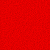

# sand

Go implementation of the original sandpile experiment showing Self-Organized Criticality (SOC).

To run the simulation with a grid of 50x50 and 1M iterations:

```sh
go run sand.go --size 50 --iters 1_000_000 --chart
```


End result of a 500 width pile after 100k iterations:

```sh
go run sand.go -s 500 -i 100_000 --pixel
```


End result of a 100 width pile after 2M iterations with height of 16:

```sh
go run sand.go -x 16 -s 100 -i 2_000_000 --pixel
```



see all options:

```sh
go run sand.go --help
```
